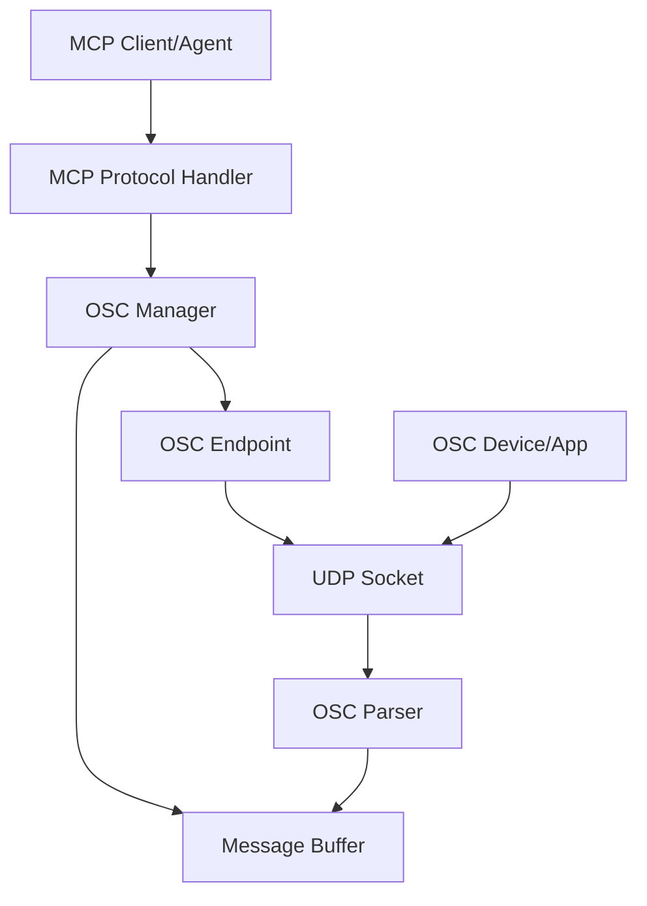

# Design Document

## Overview

The OSC MCP Server is a Model Context Protocol server that provides AI agents with tools to create OSC (Open Sound Control) endpoints and receive OSC messages. The server implements the MCP specification to expose OSC functionality through a standardized interface, enabling agents to interact with OSC-enabled devices and applications for development purposes.

The system follows a modular architecture with clear separation between MCP protocol handling, OSC message processing, and endpoint management. It uses Node.js with TypeScript and async/await patterns for concurrent handling of multiple OSC endpoints and MCP client connections. The server will be packaged as an npm package for easy distribution via npx.

**VSCode Integration**: The server is specifically designed to be fully compatible with VSCode's MCP client implementation, supporting stdio transport as the primary communication method and adhering to VSCode's expected MCP protocol patterns for seamless integration within the development environment.

### Package Structure
```
osc-mcp-server/
├── package.json
├── tsconfig.json
├── src/
│   ├── index.ts          # CLI entry point
│   ├── server.ts         # MCP server implementation
│   ├── osc/
│   │   ├── manager.ts    # OSC endpoint management
│   │   ├── endpoint.ts   # Individual OSC endpoint
│   │   ├── parser.ts     # OSC message parsing
│   │   └── buffer.ts     # Message storage
│   └── types/
│       └── index.ts      # TypeScript interfaces
├── dist/                 # Compiled JavaScript
└── bin/
    └── osc-mcp-server    # Executable script
```

### NPX Usage
Users will be able to run the server directly with:
```bash
npx osc-mcp-server
```

The package.json will include a `bin` field pointing to the compiled entry point, enabling global installation and npx execution.

### CI/CD and Publishing

The project will include automated CI/CD pipeline for npm package publishing:

**GitHub Actions Workflow**:
- Automated testing on multiple Node.js versions (18, 20, 22)
- TypeScript compilation and type checking
- Automated npm publishing on version tags
- Semantic versioning with conventional commits
- Automated changelog generation

**Publishing Strategy**:
- Automatic publishing to npm registry on tagged releases
- Pre-release versions for beta testing
- Package provenance and security scanning
- Automated dependency updates via Dependabot

**Package Configuration**:
```json
{
  "name": "osc-mcp-server",
  "version": "1.0.0",
  "bin": {
    "osc-mcp-server": "./dist/index.js"
  },
  "files": ["dist/", "README.md", "LICENSE"],
  "engines": {
    "node": ">=18.0.0"
  }
}
```

## Architecture

The system consists of four main layers:

1. **MCP Protocol Layer**: Handles MCP client communication and tool registration
2. **OSC Management Layer**: Manages OSC endpoint lifecycle and configuration
3. **OSC Processing Layer**: Handles OSC message parsing and storage
4. **Network Layer**: Manages UDP socket communication for OSC messages



## Components and Interfaces

### MCP Server Component

**Purpose**: Implements the MCP server protocol and exposes OSC tools to agents with full VSCode compatibility.

**Key Methods**:
- `handleInitialize()`: Initialize MCP server capabilities with VSCode-compatible response format
- `handleListTools()`: Return available OSC tools in MCP-compliant format
- `handleCallTool()`: Execute OSC tool requests with proper error handling for VSCode
- `handleShutdown()`: Clean up resources on server shutdown
- `handleStdioTransport()`: Manage stdio-based communication for VSCode integration

**VSCode Compatibility Features**:
- Stdio transport support as primary communication method
- MCP protocol compliance for proper VSCode integration
- Graceful connection lifecycle management for VSCode disconnects/reconnects
- Structured error responses that VSCode can display appropriately
- Server capability advertisement compatible with VSCode's MCP client

**Tools Exposed**:
- `create_osc_endpoint`: Create new OSC listening endpoint
- `stop_osc_endpoint`: Stop and cleanup OSC endpoint
- `get_osc_messages`: Query received OSC messages
- `get_endpoint_status`: Get status of OSC endpoints

### OSC Manager Component

**Purpose**: Manages the lifecycle of OSC endpoints and coordinates message handling.

**Key Methods**:
- `createEndpoint(port, bufferSize, filters)`: Create new OSC endpoint
- `stopEndpoint(endpointId)`: Stop specific endpoint
- `getEndpointStatus(endpointId)`: Get endpoint information
- `cleanupAllEndpoints()`: Stop all endpoints on shutdown

**State Management**:
- Maintains registry of active endpoints
- Tracks endpoint configurations and status
- Manages endpoint-specific message buffers

### OSC Endpoint Component

**Purpose**: Handles individual OSC listening endpoints and UDP communication.

**Key Methods**:
- `startListening()`: Begin UDP socket listening
- `stopListening()`: Close UDP socket and cleanup
- `handleMessage(data, addr)`: Process incoming OSC messages
- `getStatus()`: Return endpoint status information

**Configuration**:
- Port number (1024-65535)
- Buffer size for message storage
- Address pattern filters
- Endpoint ID for management

### OSC Parser Component

**Purpose**: Parses OSC messages according to OSC 1.0 specification.

**Key Methods**:
- `parseMessage(data)`: Parse raw OSC message bytes
- `extractAddressPattern(data)`: Get OSC address from message
- `extractTypeTags(data)`: Get argument type information
- `extractArguments(data, types)`: Parse message arguments

**Supported Types**:
- Integers (32-bit)
- Floats (32-bit)
- Strings (null-terminated)
- Blobs (binary data)

### Message Buffer Component

**Purpose**: Stores and manages received OSC messages with configurable retention.

**Key Methods**:
- `addMessage(message, timestamp)`: Store new OSC message
- `getMessages(filters, limit)`: Query stored messages
- `cleanupOldMessages()`: Remove messages beyond buffer limit
- `filterByPattern(pattern)`: Filter messages by address pattern

**Storage Structure**:
```typescript
{
    timestamp: "2024-01-01T12:00:00Z",
    address: "/synth/freq",
    typeTags: "f",
    arguments: [440.0],
    sourceIp: "192.168.1.100",
    sourcePort: 57120
}
```

## Data Models

### OSC Message Model
```typescript
interface OSCMessage {
    timestamp: Date;
    address: string;
    typeTags: string;
    arguments: (number | string | Buffer)[];
    sourceIp: string;
    sourcePort: number;
}
```

### OSC Endpoint Model
```typescript
interface OSCEndpoint {
    id: string;
    port: number;
    status: 'active' | 'stopped' | 'error';
    bufferSize: number;
    addressFilters: string[];
    createdAt: Date;
    messageCount: number;
}
```

### Tool Response Models
```typescript
interface CreateEndpointResponse {
    endpointId: string;
    port: number;
    status: string;
    message: string;
}

interface MessageQueryResponse {
    messages: OSCMessage[];
    totalCount: number;
    filteredCount: number;
}
```

## Error Handling

### Network Errors
- **Port in use**: Return specific error with suggested alternative ports
- **Permission denied**: Handle privileged port access attempts
- **Network unreachable**: Manage network connectivity issues

### OSC Protocol Errors
- **Malformed messages**: Log errors but continue processing
- **Unsupported types**: Skip unsupported arguments, process what's possible
- **Buffer overflow**: Implement circular buffer with oldest message removal

### MCP Protocol Errors
- **Invalid tool calls**: Return structured error responses
- **Missing parameters**: Validate and return parameter requirements
- **Server shutdown**: Gracefully close all endpoints before termination

### Error Response Format
```typescript
{
    error: {
        code: "PORT_IN_USE",
        message: "Port 8000 is already in use",
        details: {
            suggestedPorts: [8001, 8002, 8003]
        }
    }
}
```

### VSCode MCP Integration

**Transport Layer**: The server uses stdio transport for communication with VSCode's MCP client, handling JSON-RPC messages over standard input/output streams.

**Protocol Compliance**: Full adherence to MCP specification ensures proper integration:
- Correct initialization handshake with capability advertisement
- Proper tool registration and metadata formatting
- Standard error codes and response structures
- Graceful handling of connection lifecycle events

**Connection Management**: Robust handling of VSCode-specific connection patterns:
- Automatic reconnection support without data loss
- Proper cleanup of OSC endpoints during disconnections
- State preservation across VSCode restarts
- Logging compatible with VSCode's output channels

## Testing Strategy

### Unit Tests
- **OSC Parser**: Test message parsing with various OSC message formats
- **Message Buffer**: Test storage, retrieval, and filtering functionality
- **Endpoint Management**: Test endpoint lifecycle and configuration
- **Error Handling**: Test all error conditions and recovery

### Integration Tests
- **MCP Protocol**: Test tool registration and execution through MCP client
- **OSC Communication**: Test end-to-end OSC message flow
- **Concurrent Endpoints**: Test multiple simultaneous OSC endpoints
- **Resource Cleanup**: Test proper cleanup on shutdown

### Performance Tests
- **Message Throughput**: Test handling of high-frequency OSC messages
- **Memory Usage**: Test message buffer memory management
- **Concurrent Connections**: Test multiple MCP clients and OSC endpoints

### Test OSC Applications
- Use existing OSC applications (SuperCollider, Max/MSP, TouchOSC) for integration testing
- Create simple test OSC senders for automated testing
- Test with various OSC message types and frequencies